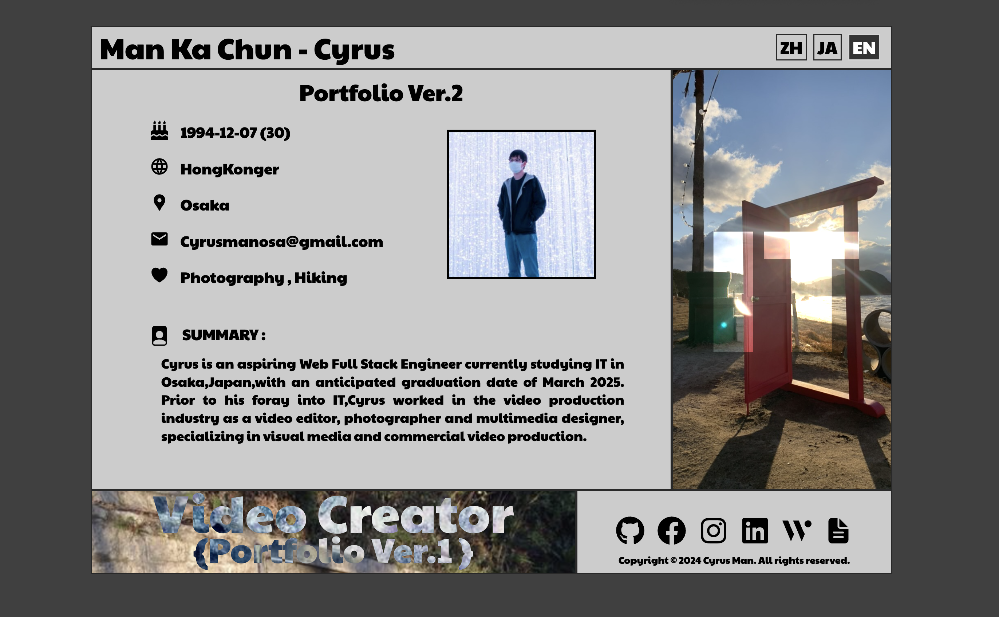
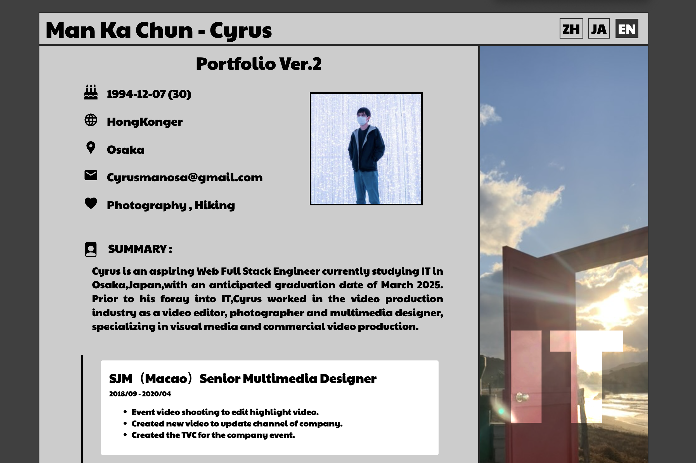
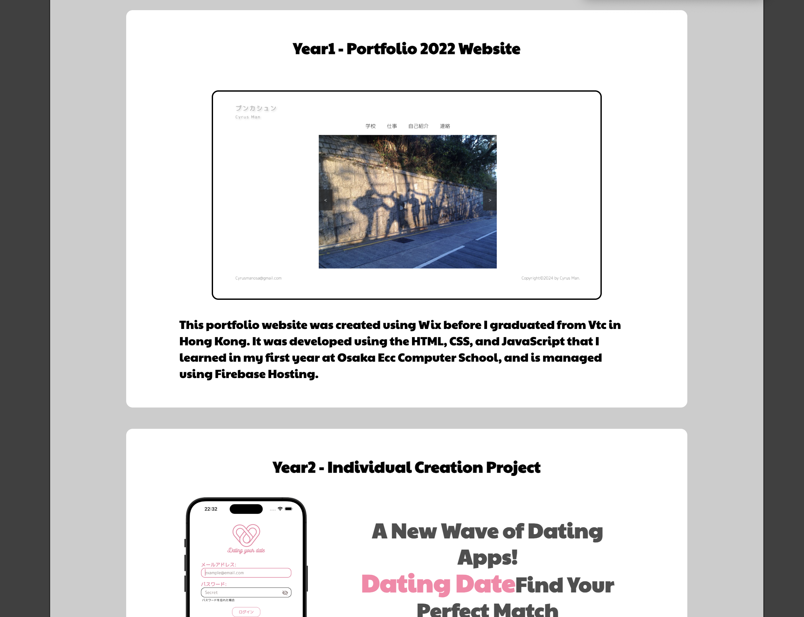

# Portfolio 2024

### Website Version

### Phone Version

## Introduction
This 2024 portfolio integrates with the GitHub API to showcase repository items in a website dialog. Its simple and user-friendly interface (UI/UX) is presented on a single page.
The website supports internationalization (i18n) for Cantonese, English, and Japanese. It also allows users to access the 2022 portfolio version. On hover, interactive elements reveal work history information and descriptions of IT projects.
The mobile version adopts a receipt-style concept, excluding project listings and available only in English. 

*If new ideas emerge, a backend using Go may be considered.

## Software And Tools
- React.js
- i18n (Language plugin)
- VsCode
- Vercel

## Link
[Portfolio2024](https://portfolio-2024-eight-tau.vercel.app/)

### Installation

1. Clone the repository
2. Run `npm install`
3. Run `npm run dev`
